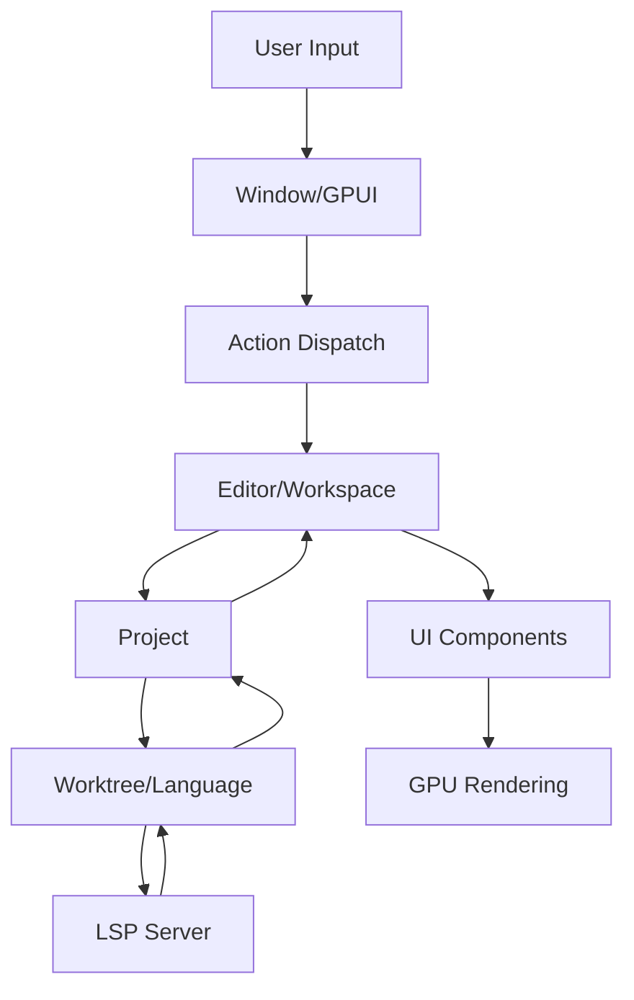

## System Architecture

Glass is a high-performance, multiplayer code editor built in Rust with a modular architecture organized into 200+ crates. The editor is built on top of the GPUI framework, which provides the UI rendering and state management foundation.

## Core Architecture Layers

### Application Layer

The top-level `zed` crate serves as the main application entry point, orchestrating all major subsystems:

- **Workspace Management** - Multi-pane editing environment
- **Editor Core** - Text editing, syntax highlighting, and code intelligence
- **Project Management** - File system operations and project state
- **Collaboration** - Real-time multiplayer editing via RPC
- **Extensions** - Plugin system for language support and features

### UI Framework Layer (GPUI)

Glass uses GPUI (https://github.com/Obsydian-HQ/gpui) as its custom UI framework:

- **Platform Abstraction** - Cross-platform window management (macOS, Linux, Windows)
- **GPU-Accelerated Rendering** - Uses Metal, DirectX, or Vulkan via wgpu
- **Reactive UI** - Component-based architecture with efficient updates
- **Event System** - Input handling, actions, and key bindings
- **Layout Engine** - Flexbox-based layout system via Taffy

See [GPUI Framework](/reference/gpui-framework) for detailed information.

### Core Subsystems

<Tabs>
  <Tab title="Text & Language">
    - **text** - Rope-based text representation with efficient editing
    - **rope** - Persistent data structure for large text buffers
    - **language** - Language server protocol (LSP) integration
    - **lsp** - LSP client implementation
    - **syntax** - Tree-sitter based syntax parsing
    - **multi_buffer** - Multiple buffer management and excerpts
  </Tab>
  
  <Tab title="Project & Files">
    - **project** - Project state and coordination
    - **worktree** - File system watching and indexing
    - **fs** - File system abstraction
    - **git** - Git integration and status tracking
    - **search** - Project-wide search functionality
  </Tab>
  
  <Tab title="Collaboration">
    - **client** - Collaboration client
    - **rpc** - Remote procedure call framework
    - **proto** - Protocol buffer definitions
    - **remote** - Remote development support
  </Tab>
  
  <Tab title="AI Integration">
    - **agent** - AI agent coordination
    - **agent_ui** - Agent panel UI
    - **language_model** - LLM provider abstraction
    - **language_models** - Provider implementations (Anthropic, OpenAI, etc.)
    - **edit_prediction** - AI-powered code completion
  </Tab>
</Tabs>

## Key Architectural Patterns

### Entity-Component System

GPUI uses an entity-based architecture where state is managed through `Entity<T>` handles:

```rust
// Entity handles provide safe concurrent access
let editor: Entity<Editor> = cx.new(|cx| Editor::new(...));
editor.update(cx, |editor, cx| {
    editor.handle_input(...);
});
```

### Async-First Design

All I/O operations use async Rust with GPUI's executor:

- Foreground tasks run on the main thread via `cx.spawn()`
- Background work uses `cx.background_spawn()`
- Tasks are cancellable by dropping the `Task<T>` handle

### Event-Driven Updates

Components communicate through:

- **Actions** - User-triggered commands dispatched via keybindings
- **Events** - Entity-to-entity communication via `cx.emit()`
- **Notifications** - UI update triggers via `cx.notify()`
- **Subscriptions** - Observer pattern for entity changes

## Data Flow



## Concurrency Model

<Note>
  All UI updates and entity mutations happen on the foreground thread. Background threads are used for:
  - File system operations
  - Network I/O
  - LSP communication
  - Syntax parsing
  - Search indexing
</Note>

## Extension Architecture

Extensions run in isolated WASM sandboxes:

- **extension_api** - WASM interface definitions
- **extension_host** - WASM runtime (Wasmtime)
- **extension** - Extension loading and lifecycle
- Language servers, themes, and slash commands are extension types

## Build Targets

Glass supports multiple platforms:

- **macOS** - Native via Metal graphics
- **Linux** - X11 and Wayland support
- **Windows** - Native DirectX rendering
- **FreeBSD** - Community-supported build

See [Build System](/reference/build-system) for compilation details.

## Performance Considerations

### Text Rendering

- GPU-accelerated glyph rasterization
- Incremental layout updates
- Virtual scrolling for large files

### Memory Management

- Rope data structure enables sharing of unchanged text
- Copy-on-write semantics for efficient undo/redo
- Weak references prevent circular ownership

### Incremental Parsing

- Tree-sitter provides O(log n) incremental updates
- Syntax trees shared across multiple views
- Async parsing doesn't block UI

## Related Pages

- [GPUI Framework](/reference/gpui-framework) - Detailed UI framework documentation
- [Crate Organization](/reference/crates) - Complete crate dependency graph
- [Build System](/reference/build-system) - Compilation and optimization settings