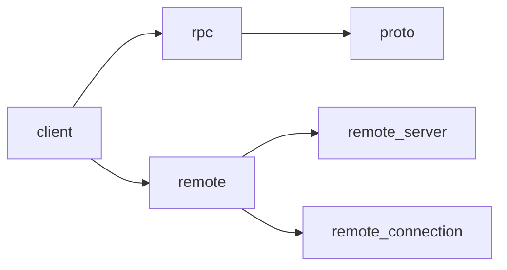

## Workspace Organization

Glass uses a Cargo workspace with 200+ member crates organized into functional groups:

```toml
[workspace]
resolver = "2"
members = [
    "crates/*",
    "extensions/*",
    "tooling/*",
]
default-members = ["crates/zed"]
```

## Major Crate Categories

### Application & Entry Points

<Tabs>
  <Tab title="Main Application">
    **zed** - Main application binary
    - Entry point: `src/main.rs`
    - Coordinates all major subsystems
    - Platform-specific initialization
    - 200+ dependencies

    **cli** - Command-line interface
    - Remote development tools
    - Extension management
  </Tab>
  
  <Tab title="UI Framework">
    **ui** - Core UI component library
    - Built on GPUI
    - Reusable components (buttons, inputs, lists)
    - Theme integration

    **component** - Advanced UI components
    **icons** - Icon set
    **theme** - Theme system
  </Tab>
</Tabs>

### Editor & Text

#### Core Text Crates

| Crate | Purpose |
|-------|----------|
| **editor** | Main editor implementation |
| **text** | Text buffer data structure |
| **rope** | Persistent rope for efficient editing |
| **multi_buffer** | Multiple buffer management |
| **buffer_diff** | Diff computation |
| **syntax** | Syntax highlighting via Tree-sitter |

#### Language Support

```rust
// Language crate provides LSP integration
language           // LSP client and language features
lsp                // Language Server Protocol
languages          // Built-in language definitions
language_extension // Extension API for languages
language_selector  // UI for selecting languages
```

### Project Management

<Note>
  Project management crates handle file systems, Git integration, and project-wide operations.
</Note>

**project** - Central project coordination
- File watching and indexing
- LSP server lifecycle
- Symbol search
- Diagnostics aggregation

**worktree** - File system representation
- Directory watching
- File tree structure
- Git status integration

**fs** - File system abstraction
- Async I/O
- Platform differences
- Virtual file systems for testing

**git** - Git integration
- Status tracking
- Blame information
- Repository operations

### Collaboration & Networking



**client** - Collaboration client
- Connection management
- User presence
- Channel communication

**rpc** - RPC framework
- Message routing
- Peer-to-peer connections

**proto** - Protocol definitions
- Protocol buffer schemas
- Generated Rust code

**remote** - Remote development
- SSH connection management
- Remote file system access

### AI & Language Models

#### Core AI Crates

**agent** - AI agent coordination
**agent_ui** - Agent panel interface
**agent_settings** - Agent configuration
**language_model** - LLM provider abstraction
**language_models** - Provider implementations

#### LLM Provider Integrations

- **anthropic** - Claude integration
- **open_ai** - OpenAI/GPT integration
- **google_ai** - Gemini integration
- **ollama** - Local Ollama models
- **bedrock** - AWS Bedrock
- **deepseek** - DeepSeek models
- **mistral** - Mistral AI
- **x_ai** - xAI/Grok
- **open_router** - OpenRouter proxy

#### Code Intelligence

**copilot** - GitHub Copilot integration
**copilot_chat** - Copilot chat interface
**supermaven** - Supermaven completion
**edit_prediction** - AI-powered predictions
**edit_prediction_ui** - Prediction UI

### UI Components & Panels

#### Editor UI

```rust
breadcrumbs          // File path breadcrumbs
go_to_line          // Go to line dialog
line_ending_selector // Line ending picker
encoding_selector    // File encoding selector
language_selector    // Language mode picker
```

#### Workspace UI

```rust
workspace           // Main workspace container
workspace_modes     // Workspace mode management
project_panel       // File tree sidebar
sidebar             // Sidebar container
title_bar           // Window title bar
platform_title_bar  // Platform-specific title
tab_switcher        // Tab switching UI
```

#### Tool Panels

| Crate | Description |
|-------|-------------|
| **search** | Project-wide search |
| **diagnostics** | Error/warning panel |
| **terminal_view** | Integrated terminal |
| **git_ui** | Git panel |
| **git_graph** | Git history visualization |
| **debugger_ui** | Debugger interface |
| **tasks_ui** | Task runner UI |

### Debugging & Development

**dap** - Debug Adapter Protocol client
**dap_adapters** - DAP adapter implementations
**debug_adapter_extension** - Extension API for debuggers
**debugger_tools** - Debugging utilities
**debugger_ui** - Debug panel UI

### Extension System

<Tabs>
  <Tab title="Runtime">
    **extension** - Extension loading
    **extension_host** - WASM runtime (Wasmtime)
    **extension_api** - WASM interface
    **extensions_ui** - Extension marketplace UI
  </Tab>
  
  <Tab title="Types">
    **language_extension** - Language extensions
    **theme_extension** - Theme extensions
    **assistant_slash_command** - Slash command API
  </Tab>
</Tabs>

### Utilities & Infrastructure

#### Core Utilities

```rust
util          // General utilities (GPUI)
collections   // Data structures (GPUI)
sum_tree      // Persistent tree (GPUI)
scheduler     // Task scheduling (GPUI)
refineable    // Style refinement (GPUI)
```

#### Settings & Configuration

```rust
settings        // Settings system
settings_ui     // Settings UI
settings_json   // JSON settings
settings_macros // Settings derive macros
keymap_editor   // Keybinding editor
```

#### Data & Persistence

```rust
db           // SQLite database
sqlez        // Zero-copy SQLite
sqlez_macros // SQL macros
session      // Session management
```

#### Telemetry & Logging

```rust
telemetry        // Usage telemetry
telemetry_events // Event definitions
zlog             // Logging system
zlog_settings    // Log configuration
ztracing         // Distributed tracing
ztracing_macro   // Tracing macros
```

### Platform-Specific

**Platform Abstractions**

- **native_platforms** - Platform detection
- **native_platforms_ui** - Platform UI integration
- **etw_tracing** - Windows ETW tracing

**Platform Features**

- **audio** - Audio playback
- **crashes** - Crash reporting
- **auto_update** - Auto-update system
- **install_cli** - CLI installation

### Specialized Features

#### Document Viewers

- **markdown_preview** - Markdown rendering
- **svg_preview** - SVG viewer
- **image_viewer** - Image viewer
- **browser** - Embedded browser

#### Developer Tools

- **repl** - REPL integration (Jupyter)
- **component_preview** - Component preview
- **inspector_ui** - UI inspector
- **miniprofiler_ui** - Performance profiler

#### Search & Navigation

```rust
fuzzy           // Fuzzy matching
file_finder     // File finder dialog
picker          // Generic picker UI
command_palette // Command palette
menu            // Menu system
```

## Dependency Management

### Workspace Dependencies

All dependencies are declared once in the root `Cargo.toml`:

```toml
[workspace.dependencies]
# Internal crates
editor = { path = "crates/editor" }
project = { path = "crates/project" }

# External crates
anyhow = "1.0.86"
serde = { version = "1.0.221", features = ["derive", "rc"] }

# GPUI framework
gpui = { git = "https://github.com/Obsydian-HQ/gpui.git" }
```

Crates then reference workspace dependencies:

```toml
[dependencies]
editor.workspace = true
anyhow.workspace = true
gpui.workspace = true
```

### Key External Dependencies

| Dependency | Purpose |
|------------|----------|
| **tree-sitter** | Syntax parsing |
| **lsp-types** | LSP protocol |
| **tokio** | Async runtime |
| **serde** | Serialization |
| **wgpu** | GPU rendering |
| **wasmtime** | WASM runtime |

## Crate Dependency Graph

### Core Dependencies

```
zed
├── workspace
│   ├── project
│   │   ├── worktree
│   │   ├── language
│   │   │   ├── lsp
│   │   │   └── text
│   │   │       └── rope
│   │   └── fs
│   ├── editor
│   │   ├── multi_buffer
│   │   │   └── text
│   │   ├── language
│   │   └── ui
│   └── ui
│       ├── gpui
│       └── theme
├── client
│   └── rpc
│       └── proto
└── gpui
```

## Build Configuration

### Edition & License

```toml
[workspace.package]
publish = false
edition = "2024"
license = "GPL-3.0-or-later"
```

### Optimization Settings

See [Build System](/reference/build-system) for details on:
- Release profiles
- Proc-macro optimization
- Codegen units
- LTO settings

## Testing Support

Many crates provide test-support features:

```toml
[features]
test-support = [
    "gpui/test-support",
    "project/test-support",
    "editor/test-support",
]
```

This enables:
- Mock implementations
- Test utilities
- Deterministic behavior

## Related Pages

- [Architecture Overview](/reference/architecture) - System design
- [GPUI Framework](/reference/gpui-framework) - UI framework details
- [Build System](/reference/build-system) - Compilation configuration